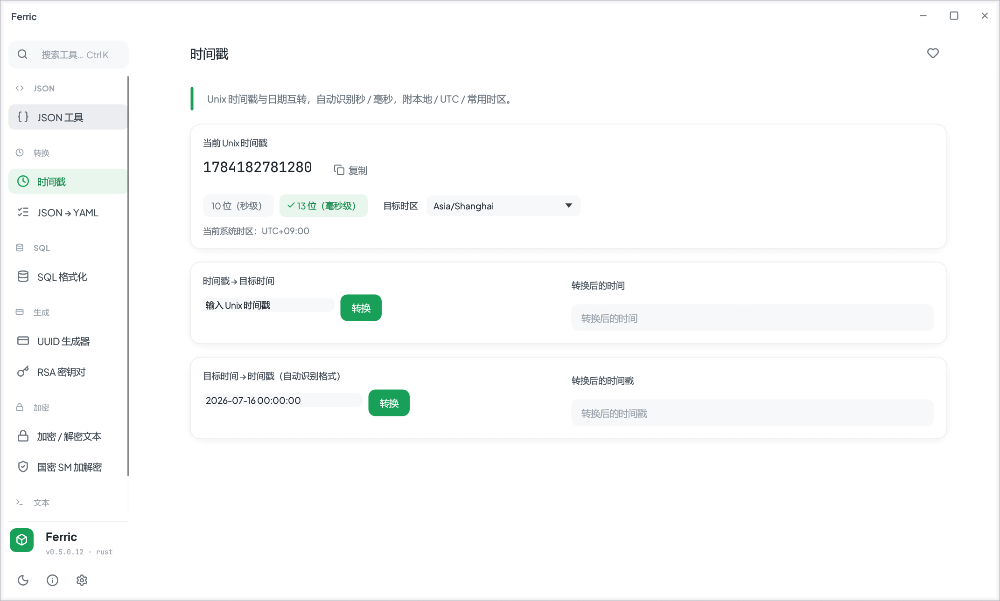

# Ferric

跨平台原生 **Rust** 开发者工具箱。基于 [egui](https://github.com/emilk/egui) / eframe 的高性能即时模式 GUI（非 Tauri/Web 方案），单二进制，运行于 **Windows / macOS / Linux**。



## 下载

安装包见 [Releases](https://github.com/llux23540-commits/ferric/releases/latest)，按平台选：

| 你的机器 | 下载哪个 |
|---|---|
| Windows · Intel / AMD（x64，最常见） | `…windows-x86_64-setup.exe`（安装版）或 `…-portable.exe`（免安装单文件） |
| Windows · ARM（骁龙 Snapdragon 本） | `…windows-aarch64-setup.exe` 或对应 portable |
| Mac · Apple 芯片（M1–M4） | `…macos-aarch64.dmg` |
| Mac · Intel | `…macos-x86_64.dmg` |
| Linux · Intel / AMD（x64） | `…linux-x86_64.deb`（Debian/Ubuntu）或 `.AppImage`（任意发行版） |
| Linux · ARM64（树莓派等） | `…linux-aarch64.deb` 或对应 `.AppImage` |

> x64 = x86_64 = amd64 是同一个东西的三种叫法，Intel 和 AMD 的处理器都用它；
> aarch64 = ARM64（Apple 芯片、骁龙、树莓派同属这一架构，但系统各自要装各自的包）。
>
> **Windows 升级**：直接双击新版 setup 即可**覆盖安装**，无须先卸载旧版
>（安装器检测到旧版会静默覆盖，不再弹「是否先卸载」）；应用内更新更进一步 ——
> 点「安装」后走静默覆盖并自动重启 Ferric，全程无须点任何安装向导。
> 安装按当前用户进行，不需要管理员权限（无 UAC 弹窗）。
> 首次运行时 Windows SmartScreen 的「已保护你的电脑」提示来自**未购买代码签名证书**，
> 点「更多信息 → 仍要运行」即可；这与安装方式无关，签名证书就绪前无法消除。
>
> **Mac 首次打开**：应用是 ad-hoc 签名（未做 Apple 公证），首次会提示无法验证——
> 系统设置 → 隐私与安全性 → 底部「仍要打开」。若提示「已损坏」：`xattr -cr /Applications/Ferric.app`。

## 已实现（10 工具）

外壳：自绘无边框窗口（拖拽 / 最小化 / 最大化 / 关闭）、亮/暗主题、可拖拽调宽侧边栏、`Ctrl+K` 命令面板、工具收藏、全工具草稿持久化、CJK 字体自动加载。

工具：

| 工具 | 说明 |
|---|---|
| JSON 工具 | 格式化 / 压缩 / 校验 / 转义 / 去转义（多层转义与内嵌 JSON 字符串一次剥完）/ 键名排序，`Ctrl+F` 搜索（Enter/F3 逐个跳转），三连击直接选中整个字符串值，缩进 2·4·Tab，撤销重做，铺满式行号编辑区 + 折叠树视图，长行自动换行（可关，关后横向滚动） |
| 文本 / 文件对比 | 逐行 diff，差异直接高亮在左右编辑面板内（删除标左、新增标右，字符级标记），左右同步滚动，`Ctrl+F` 搜索（聚焦哪侧搜哪侧，未聚焦两侧一起），载入 / 拖入文件 |
| 时间戳 | Unix ↔ 日期时间，秒/毫秒，全量时区可搜索，自动识别多种日期格式 |
| JSON → YAML | JSON 转 YAML，实时校验 |
| SQL 格式化 | 格式化 / 压缩为单行，关键字大写开关 |
| UUID 生成器 | UUID v4 / v7 / v6 / v5（命名空间），大小写 / 无连字符，Raw / JSON，执行历史 |
| RSA 密钥对 | 256–4096 位，后台线程生成，PEM 输出 |
| 加密 / 解密文本 | AES / TripleDES / Rabbit（RFC 4503）/ RC4，OpenSSL 盐格式，与 crypto-js 兼容 |
| 国密 SM | SM4 对称、SM2 公钥加解密、SM3 摘要，一键生成 SM2 密钥对 |
| 正则表达式 | g/i/m/s/x 标志，分组捕获展示，常用语法备忘单 |

## 自动更新与插件市场

客户端可对接 [ferric-server](https://github.com/llux23540/ferric-server)：检查/下载安装包、
浏览并安装 WASM 插件。**没有 TLS，安全性靠三把独立的锁**，全部在编译期烘进二进制：

| 编译期变量 | 作用 |
|---|---|
| `FERRIC_SERVER_URL` | 服务端地址（`…/api/v1`） |
| `FERRIC_SERVER_PUBKEY` | 传输加密公钥（SM2）。客户端**永不**去 `/crypto/pubkey` 取——那等于让对方自报家门 |
| `FERRIC_RELEASE_PUBKEY` | 发布验签公钥。私钥永不上服务器，**安装包与插件都必须验签** |

```sh
FERRIC_SERVER_URL=http://updates.example.com/api/v1 \
FERRIC_SERVER_PUBKEY=04… FERRIC_RELEASE_PUBKEY=04… \
  cargo build --release -p ferric-app
```

三个值缺省时相关功能整体禁用，**绝不回落到「去服务端问公钥」**；未烘入验签公钥的构建
既装不了更新也装不了插件——无法验证来源时，唯一安全的行为是不装。

### 更新是怎么走完的

「检查 → 下载 → 安装」里只有**最后一步**需要人点：

1. 启动 4 秒后自动检查（跨启动节流，最短间隔 6 小时；设置里可关）；
2. 发现新版**自动在后台下载**，并做 sha256 + 魔数 + 离线签名三重校验；
3. 校验通过后弹出更新框，点「立即安装」即覆盖安装并退出；也可先「稍后」，顶栏的「安装 vX」按钮仍在。

**后台绝不自动安装**：那一步会关掉用户正在用的应用，必须由他自己决定。
自动后台下载也只对**内置服务器**开放；自定义更新源只提示新版本，不下载不执行。

### 没有服务器也能跑：演示数据

设置 → 数据源 → 自动 / 服务器 / **演示**。没烘入 `FERRIC_SERVER_URL` 的构建默认走演示：
插件市场有一份固定的插件目录，更新那边有一个「新版本」，下载进度真的会走
（分块 + 真实耗时），装完的状态会存盘。

演示分支**碰不到任何安全边界**：不写插件目录（那条路只接受验签通过的字节）、
不执行任何安装程序、界面上一律标注「演示数据」。它能造成的最坏结果就是
「界面上多了几条假数据」。

### 插件装完立刻生效

装 / 卸插件之后不必重启：外壳会在当前帧渲染结束后重新加载插件目录，
保留当前选中的工具与各插件的输入草稿。市场页支持「全部更新」（逐个装，带进度条），
进页面即自动拉取列表。

插件跑在 wasmtime 沙箱里，但沙箱管的是「能碰到什么」，管不了「算出什么」（一个伪造的
「加密工具」插件完全可以在沙箱内输出可预测的密文），所以插件与安装包走同一条离线签名链。
签名清单绑定了 slug，**换个身份重放也不行**。

## 结构

```
crates/
  ferric-core/   纯逻辑（无 GUI），带单元测试
  ferric-ui/     egui 视图与外壳；新增工具 = 加 views/*.rs + registry() 注册一行
  ferric-app/    eframe 入口
```

## 开发

需要 Rust stable。

```sh
cargo run -p ferric-app     # 运行
cargo test                  # 核心逻辑单测
cargo clippy --all-targets  # 静态检查
```

### 打包发行版

打包配置在 `crates/ferric-app/Cargo.toml` 的 `[package.metadata.packager]`（cargo-packager）。

```sh
cargo install cargo-packager --locked
cargo build --release -p ferric-app
cargo packager --release --formats nsis   # Windows 安装包；macOS 用 dmg，Linux 用 deb / appimage
```

产物输出到 `target/release/`，如 `ferric_<版本>_x64-setup.exe`；
免安装便携版直接分发 `target/release/ferric.exe` 即可（单二进制，无外部依赖）。

### Windows on ARM64 说明

本仓库默认针对 `aarch64-pc-windows-msvc`（原生）。原生构建需安装
`Microsoft.VisualStudio.Component.VC.Tools.ARM64`（VS Build Tools 里的 “MSVC ARM64 build tools”）。
用 `setup.exe modify --quiet` 静默安装时**必须以管理员身份运行**（否则报 5007）。

x64 模拟工具链虽能编译，但模拟进程无法访问 GPU，GUI 跑不起来——请用原生 aarch64 构建。

#### 渲染后端（DX12）

GUI 用 wgpu 后端，Windows 走 **DX12**。注意 eframe 0.29 默认没给 wgpu 开 `dx12`
feature，因此 `ferric-app` 在自己的依赖里**显式启用** `wgpu = { features = ["dx12"] }`
（feature 会合并进 eframe 共用的 wgpu 构建）。否则在没有 Vulkan 驱动、OpenGL 仅 1.1 的
环境（如 **QEMU 虚拟机**：只有 “Microsoft Basic Render Driver” 软件 **WARP** 适配器）会
报 `NoSuitableAdapterFound`。

WARP 软件光栅化器只支持 **不透明** 表面，所以窗口默认 `with_transparent(false)`；
有硬件 GPU 时可在 `crates/ferric-app/src/main.rs` 改回 `true` 获得圆角透明效果。

## 排障

### 整个界面发糊（尤其虚拟机）

按嫌疑从大到小排查：

1. **Windows 显示缩放 125%/150% + 旧版本**：旧版 exe 未嵌 DPI 清单，声明一旦失效
   （远程桌面等场景）就会被系统整窗位图拉伸 —— 那是无解的糊。现版本已在 exe 里
   嵌入 `PerMonitorV2` 清单，进程创建即生效，请升级后再看。
2. **虚拟机软件把客户机画面拉伸显示**（VMware「自动适应客户机」、VirtualBox 缩放
   模式等）：宿主侧的位图缩放，任何应用都救不了。把客户机分辨率设为与显示窗口
   1:1，或关闭 hypervisor 的缩放。
3. **软件渲染**：设置 → 渲染后端 下方若有红字「正在软件渲染」，说明没有 GPU
   加速（虚拟机未开 3D 加速 / 无驱动）。此环境下 Ferric 会自动关掉阴影等
   大范围渐变效果保持边缘干净，但整体锐度仍受制于环境 —— 开 3D 加速最有效。
4. **界面缩放非 100%**：设置 → 界面缩放 调回 100% 对比。

### 画面闪烁 / 撕裂 / 打不开

同一份二进制在不同机器上走的图形路径完全不同（独显走 DX12/Vulkan，虚拟机与精简系统会
退化到 WARP 软件光栅化，远程桌面又是另一套），这类毛病高度依赖驱动实现，**换一个渲染
后端往往立刻就好**：

设置 → 渲染后端 → 自动 / DX12 / Vulkan / OpenGL，**重启后生效**。选择记在
`launch.json` 里（位置见下），启动时在建窗之前读取。

自愈逻辑：启动前写下「正在尝试 X」，画满 3 帧才算成功并清掉。若上次启动崩在半路，
下次会自动把 X 排到最后、改用下一个后端 —— 因此**再点一次就能进去**，不会永远卡在
同一个坑里。一次成功启动会清空黑名单（装了驱动、开了 3D 加速，环境是会变好的）。
你锁定的后端若在本机根本不可用（如虚拟机里没有 ≥3.3 的 OpenGL、没有 Vulkan），
失败一次后会由兜底后端跑起来，并**自动把选择改回「自动」**且弹提示 ——
不会陷入「每隔一次启动就报错」的循环。

也可以临时用环境变量覆盖，不写配置：

```sh
WGPU_BACKEND=gl ferric      # 可选 dx12 / vulkan / gl / metal
```

启动彻底失败时会弹窗说明，并把详情写进 `startup.log`（发行版隐藏了控制台，
stderr 没有去处，日志文件是唯一线索）。

### 状态与日志的位置

| 平台 | 目录 |
|---|---|
| Windows | `%APPDATA%\ferric\data\` |
| macOS | `~/Library/Application Support/ferric/` |
| Linux | `~/.local/share/ferric/` |

里面有 eframe 的界面状态、`launch.json`（渲染后端）与 `startup.log`。删掉即恢复出厂设置。

### 界面中文显示成方块

系统里没有中文字体。Ferric 会依次找微软雅黑 / 黑体 / 宋体（含 `%WINDIR%` 与用户字体
目录）、macOS 苹方、Linux 的 Noto CJK / 文泉驿；都找不到时会提示。装一个中文字体
（如 Noto Sans SC）即可。

### Windows：拖动窗口发花 / Alt+Tab 切回闪一下旧画面 / 切回卡顿

前两个是 DX12 flip-model 呈现与窗口合成不同步的老毛病，应用里已做缓解：
拖动窗口期间临时切到免等垂直同步的呈现模式（松手约 300ms 后恢复）；
失焦期间保持低频重绘并在拿回焦点的瞬间立即出新帧，切回时看到的旧帧
与当前状态一致，就不显闪。

若 Alt+Tab 切回仍有可感知的卡顿：**设置 → 渲染后端 → 「Alt+Tab 卡顿缓解（DX12）」**
开关开/关各试一次（重启后生效），两次点击即完成 A/B 对比 —— 怀疑对象是
wgpu DX12 的 frame-latency waitable object 在失焦期间长时间不被唤醒。
不想动设置也可以用环境变量临时试：

```powershell
$env:WGPU_DX12_USE_FRAME_LATENCY_WAITABLE_OBJECT="none"; ferric
```

开了有效请提 issue 告诉我们，好把它固化成默认值；没效则换渲染后端试试。
设置页会显示**当前实际使用的适配器**（后端 · 显卡名，软件渲染会红字标出），
切完对比一眼就能确认生效；同一行也写进 `startup.log`。

### CPU 占用偏高

软件光栅化（虚拟机 / 无驱动）下每一次重绘都是整窗的纯 CPU 光栅化，所以关键是**别多画帧**。
Ferric 里唯一会持续出帧的是时间戳工具的实时时钟，它已经做到：对齐秒边界每秒最多一次、
失焦 / 最小化 / 被完全遮挡时零调度、静置 90 秒自动停表（动一下即恢复），也可以直接关掉
「实时刷新」。其余工具不做任何空转重绘。

## 许可

MIT
